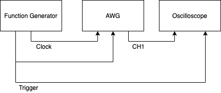

List of environments.

# Test

## Materials

1. Tektronix Oscilloscope TDS3054B
2. AWG. P2588D.
3. Network Switch
4. Function generator. SRS DG645.
5. Numerous BNC cables.

## Theory

Fundamental frequency of our RF cavity is 2856 MHz.
Wavelength is 10.4 cm
1/(2856 MHz) = 0.3501 nanosecond

## Circuit diagram

## Procedure

1. Set amplitude on reference clock to 0.

# Production
