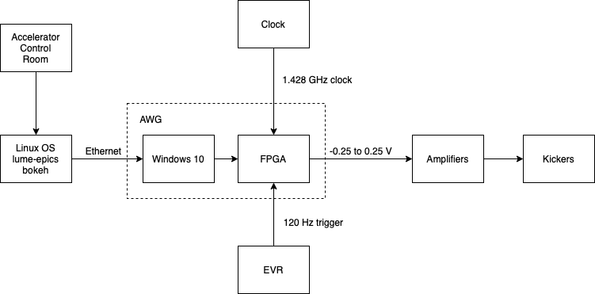

Control the electron stripline kickers in LCLS sector 21.

# Production Environment

## Materials

- Linux system. Has at least one ethernet port, display, keyboard, and mouse. Should be approved to operate in the tunnel and connect to EPICS. Capable of running Anaconda, Python 3.6, Firefox.
- AWG: Proteus P2588D
- Clock: 

## Procedure

### Turn on or off the kickers

1. Connect to the Linux server via remote desktop.
1. Start up the control interface using python.
	1. python dbfel.py
1. Start or stop the waveform sent to the AWG.

### Update the kicker software

1. Connect to the Linux server via remote desktop.
1. git pull

# Test Environment

## Materials

- Tektronix Oscilloscope TDS3054B
- AWG
- Network Switch
- Clock

## Procedure

1. Set the function generator to square pulse, 120 Hz, at least 0.5 Volt.
1. Set the clock to 1.428 GHz and 1dbm
1. Set up the AWG
   1. conda create --name myenv python=3.6
   1. source activate myenv
   1. python3 -m pip install pyvisa jupyerlab numpy bokeh matplotlib
1. Set up the network.
    1. Set the scope IP manually on the oscilloscope.
    1. Set the scope IP and MAC address on the router.
    1. Test the connection using the "Test Connection" button on the oscilloscope.
1. Start the control panel.
   1. python dbfel.py
