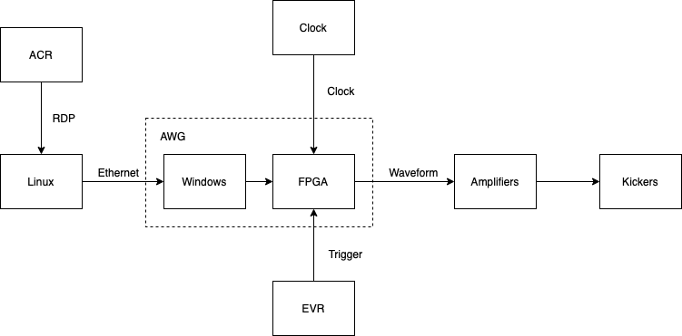
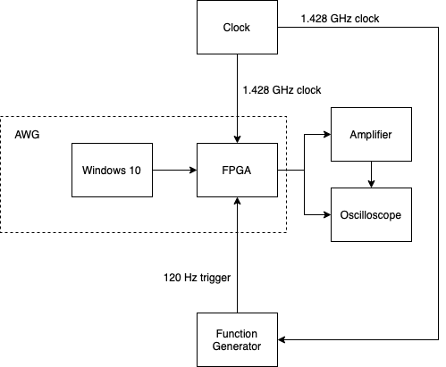

Control the electron stripline kickers in LCLS sector 21.

# Production Environment

- Ethernet: 127.0.0.1 port 5025.
- Clock: 1.428 GHz BNC.
- Trigger: 120 Hz BNC.
- Waveform: -0.25 to 0.25 V signal which is replicated by the amplifiers. Amperage unknown.
- Windows: Windows 10. Embedded.

## Materials

- Linux system. Unknown OS. Has at least one ethernet port, display, keyboard, and mouse. Should be approved to operate in the tunnel and connect to EPICS. Required to run Anaconda, Python 3.6. Not required to run graphics.
- AWG: Proteus P2588D

## Procedure

1. ...

# Test Environment

## Materials

- Building 44 room 205
- Tektronix Oscilloscope TDS3054B
- Tabor Proteus 2588D
- Network Switch : Linksys WRT110
- Trigger : SRS DG645
- Clock : Agilent N5181A

## Procedure

1. Connect the cables and turn everything on
1. Set the trigger to square pulse, 120 Hz, 0.5 Volt
1. Set the clock to 1.428 GHz and 1dbm
1. Set up the AWG once
   1. conda create --name myenv python=3.6
   1. source activate myenv
   1. python3 -m pip install pyvisa jupyerlab numpy bokeh matplotlib
1. Set up the network once
    1. Set the scope IP manually on the oscilloscope.
    1. Set the scope IP and MAC address on the router.
    1. Test the connection using the "Test Connection" button on the oscilloscope.
1. python dbfel.py
